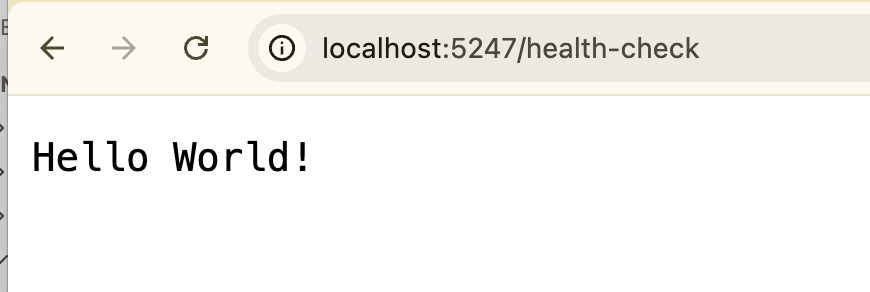
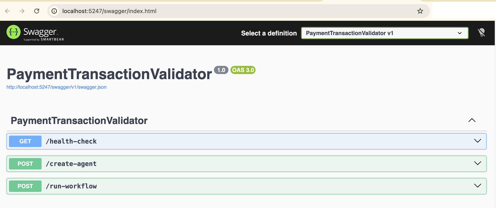
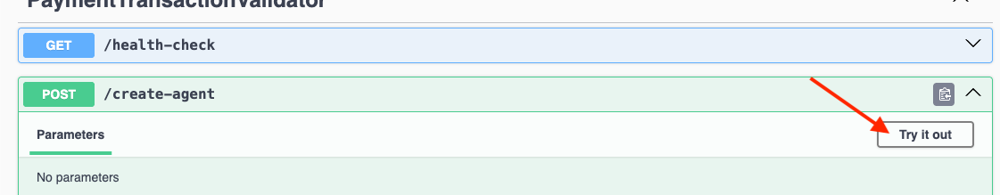
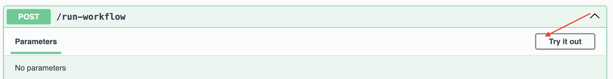

# PaymentTransactionValidator

Create a simple C# minimal API application and add to it a *Models* folder:

```bash
dotnet new webapi -n PaymentTransactionValidator
cd PaymentTransactionValidator
mkdir Models
```

Add required nuget packages:

```bash
dotnet add package Azure.AI.OpenAI -v 2.7.0-beta.2
dotnet add package Azure.Identity -v 1.17.1
dotnet add package Microsoft.Agents.AI.OpenAI -v 1.0.0-preview.251204.1
dotnet add package Microsoft.Agents.AI.Workflows -v 1.0.0-preview.251204.1
dotnet add package Microsoft.Extensions.AI.OpenAI -v 10.1.0-preview.1.25608.1
```

Add this section to *appsettings.Development.json*:

```json
"GitHub": {
  "Endpoint": "https://models.github.ai/inference",
  "ApiKey": "PUT-GITHUB-PERSONAL-ACCESS-TOKEN-HERE",
  "Model": "gpt-4.1-mini"
}
```

**Models/Prompt.cs**

```C#
public class Prompt {
    public string? Name { get; set; }
    public string? Instructions { get; set; }
    public string? Description { get; set; }
}
```

**Models/Agent.cs**

```C#
public class Agent {
    public List<Prompt>? Prompts { get; set; }
}
```

**Models/WorkflowRequest.cs**

```C#
using System.Text.Json;

public class WorkflowRequest {
    public string[]? AgentIds { get; set; } 
    public string? Question { get; set; }
    public JsonElement? Transactions { get; set; } 
}
```

**Models/ConcurrentAggregationExecutor.cs**

```C#
using System;
using Microsoft.Agents.AI.Workflows;
using Microsoft.Extensions.AI;

namespace ConcurrentWorkflow.Models;

/// <summary>
/// Executor that aggregates the results from the concurrent agents.
/// </summary>
internal sealed class ConcurrentAggregationExecutor(int expectedAgentCount = 2) :
    Executor<List<ChatMessage>>("ConcurrentAggregationExecutor") {
    private readonly List<ChatMessage> _messages = [];
    private readonly int _expectedAgentCount = expectedAgentCount;

    /// <summary>
    /// Handles incoming messages from the agents and aggregates their responses.
    /// </summary>
    /// <param name="message">The message from the agent</param>
    /// <param name="context">Workflow context for accessing workflow services and adding events</param>
    /// <param name="cancellationToken">The <see cref="CancellationToken"/> to monitor for cancellation requests.
    /// The default is <see cref="CancellationToken.None"/>.</param>
    /// <returns>A task representing the asynchronous operation</returns>
    public override async ValueTask HandleAsync(List<ChatMessage> message, IWorkflowContext context, CancellationToken cancellationToken = default) {
        this._messages.AddRange(message);

        if (this._messages.Count == _expectedAgentCount) {
            var formattedMessages = string.Join(Environment.NewLine,
                this._messages.Select(m => $"{m.AuthorName}: {m.Text}"));
            await context.YieldOutputAsync(formattedMessages, cancellationToken);
        }
    }
}
```

**Models/ConcurrentStartExecutor.cs**

```C#
using System;
using Microsoft.Agents.AI.Workflows;
using Microsoft.Extensions.AI;

namespace ConcurrentWorkflow.Models;

/// <summary>
/// Executor that starts the concurrent processing by sending messages to the agents.
/// </summary>
internal sealed class ConcurrentStartExecutor() : Executor<string>("ConcurrentStartExecutor") {
    /// <summary>
    /// Starts the concurrent processing by sending messages to the agents.
    /// </summary>
    /// <param name="message">The user message to process</param>
    /// <param name="context">Workflow context for accessing workflow services and adding events</param>
    /// <param name="cancellationToken">The <see cref="CancellationToken"/> to monitor for cancellation requests.
    /// The default is <see cref="CancellationToken.None"/>.</param>
    /// <returns>A task representing the asynchronous operation</returns>
    public override async ValueTask HandleAsync(string message, IWorkflowContext context, CancellationToken cancellationToken = default) {
        // Broadcast the message to all connected agents. Receiving agents will queue
        // the message but will not start processing until they receive a turn token.
        await context.SendMessageAsync(new ChatMessage(ChatRole.User, message), cancellationToken);

        // Broadcast the turn token to kick off the agents.
        await context.SendMessageAsync(new TurnToken(emitEvents: true), cancellationToken);
    }
}
```

In *Program.cs*, add this code :

```C#
using Azure;
using Azure.AI.OpenAI;
using Microsoft.Agents.AI;
using Microsoft.Extensions.AI;
using System.Text.Json;
using OpenAI;
using OpenAI.Chat;
using Microsoft.Extensions.Caching.Memory;

using ConcurrentWorkflow.Models;
using Microsoft.Agents.AI.Workflows;

using Microsoft.Extensions.Configuration;

var builder = WebApplication.CreateBuilder(args);

// Add MemoryCache
builder.Services.AddMemoryCache();

// Add connection string to Configuration
builder.Services.AddSingleton(sp =>
    builder.Configuration.GetConnectionString("DefaultConnection") ?? string.Empty
);

// Read configuration values for Azure OpenAI
string endpoint = builder.Configuration["GitHub:Endpoint"] ?? throw new InvalidOperationException("AzureOpenAI:Endpoint configuration is missing");
string apiKey = builder.Configuration["GitHub:ApiKey"] ?? throw new InvalidOperationException("AzureOpenAI:ApiKey configuration is missing");
string model = builder.Configuration["GitHub:Model"] ?? throw new InvalidOperationException("AzureOpenAI:DeploymentName configuration is missing");
var app = builder.Build();

// Create a chat client for OpenAI
IChatClient chatClient = new ChatClient(
    model,
    new AzureKeyCredential(apiKey!),
    new OpenAIClientOptions
    {
        Endpoint = new Uri(endpoint)
    }
)
.AsIChatClient();

app.MapGet("health-check/", () => "Hello World!");

app.MapPost("/create-agent", (Agent AgentConfig, IMemoryCache cache) => {
    // Create agents based on provided prompts
    var agents = AgentConfig.Prompts!.Select(prompt => 
        new ChatClientAgent(
            chatClient,
            name: prompt.Name!,
            instructions: prompt.Instructions!,
            description: prompt.Description!
        )).ToArray();
    
    // Store agents in cache
    foreach (var agent in agents)
    {
        cache.Set(agent.Id, agent);
    }
    
    // Prepare result with agent details
    var result = new {
        ChatClientId = chatClient.GetHashCode().ToString(),
        Agents = agents.Select(agent => new {
            Id = agent.Id,
            Name = agent.Name,
            Description = agent.Description,
            Instructions = agent.Instructions,
            DisplayName = agent.DisplayName
        }).ToArray()
    };
    
    return Results.Ok(result);
});


app.MapPost("/run-workflow", async (WorkflowRequest request, IMemoryCache cache) => {
    var startExecutor = new ConcurrentStartExecutor();
    
    // Retrieve agents from cache and convert to ExecutorBinding
    var targets = request.AgentIds!.Select(id => 
        (ExecutorBinding)cache.Get<ChatClientAgent>(id)!
    ).ToArray();
    
    // Create aggregation executor
    var aggregationExecutor = new ConcurrentAggregationExecutor(targets.Length);

    // Build the workflow by adding executors and connecting them
    var workflow = new WorkflowBuilder(startExecutor)
        .AddFanOutEdge(startExecutor, targets: targets)
        .AddFanInEdge(sources: targets, aggregationExecutor)
        .WithOutputFrom(aggregationExecutor)
        .Build();

    // Build input message
    string transactionData = request.Transactions != null 
        ? JsonSerializer.Serialize(request.Transactions) 
        : "";
    
    string inputMessage = !string.IsNullOrEmpty(transactionData) 
        ? $"Analyze these transactions: {transactionData}. {request.Question ?? "Are these transactions fraudulent?"}"
        : request.Question ?? "According the agents, are these transactions fraudulent mainly the first object? Just answer using Allow or Block.";

    // Execute the workflow in streaming mode
    await using StreamingRun run = await InProcessExecution.StreamAsync(workflow, inputMessage);
    
    // Collect the output from the workflow
    string? result = null;
    await foreach (WorkflowEvent evt in run.WatchStreamAsync())
    {
        if (evt is WorkflowOutputEvent output)
        {
            result = output.Data?.ToString();
        }
    }
        
    return Results.Ok(new { 
        WorkflowId = workflow.GetHashCode().ToString(),
        Result = result 
    });
});


app.Run();

```

**Try the application**

In a terminal window in the root folder of the app, run the application with:

```bash
dotnet run
```


Or running using .http file
```http
@GitHubAIAgentAPI_HostAddress = http://localhost:5010


POST {{GitHubAIAgentAPI_HostAddress}}/create-agent
Content-Type: application/json

{
  "prompts": [
    {
      "name": "GeospatialFraudAgent",
      "description": "Agent specialized in geospatial and temporal feasibility analysis for fraud detection",
      "instructions": "You are an expert in geospatial analysis and spatiotemporal modeling. Validate whether latitude and longitude coordinates, combined with timestamps, indicate that a person could realistically move between locations in the given time. Identify impossible or highly improbable travel patterns that may indicate card cloning or transaction replay fraud. Consider distance, time difference, typical transportation methods, and human mobility limits. You just analyze the data and your return is just: your name and allow or block."
    },
    {
      "name": "BehavioralRetryAgent",
      "description": "Agent specialized in behavioral analysis of failed transaction retries",
      "instructions": "You are an expert in behavioral fraud analysis. Analyze failed retry attempts, their frequency, timing, and failure reasons to determine whether they indicate suspicious behavior such as brute-force attempts, credential testing, or automated misuse. Identify patterns like rapid retries, repeated failures for the same reason, or escalation toward a successful transaction. You just analyze the data and your return is just: your name and allow or block."
    },
    {
      "name": "TransactionPatternAgent",
      "description": "Agent specialized in transaction pattern and contextual risk analysis",
      "instructions": "You are an expert in financial transaction analysis and fraud pattern detection. Evaluate whether the country of origin, transaction value, merchant location, and contextual metadata form suspicious patterns. Look for anomalies such as unusual country-value combinations, atypical spending behavior for a region, sudden value spikes, or inconsistencies between transaction location and user profile. You just analyze the data and your return is just: your name and allow or block."
    }
  ]
}


###

PATCH {{GitHubAIAgentAPI_HostAddress}}/run-workflow
Content-Type: application/json
{
    "Question": "I have never been to Brazil and have never purchased anything from Brazil. According to the transaction history object, is the first transaction fraudulent?",
    "AgentIds": [
        "483677cd514d4b8eb55c0c0851aa362f",
        "b4b8011e372d4c62abdbb855fcb7b158",
        "4422f07ab60646449d1e726c79aa698d"
    ],
    "transactions": [
        {
            "id": "tx-001",
            "name": "Restaurant Payment",
            "amount": 89.90,
            "timestamp": "2026-01-03T12:45:00-03:00",
            "latitude": -23.550520,
            "longitude": -46.633308,
            "sender_country": "Brazil",
            "sender_account": "BR-ACC-982341",
            "failed_attempts": [
                {
                    "attempt": 1,
                    "timestamp": "2026-01-03T12:43:10-03:00",
                    "reason": "Insufficient balance"
                }
            ]
        },
        {
            "id": "tx-002",
            "name": "Online Purchase",
            "amount": 249.99,
            "timestamp": "2026-01-03T09:15:00-03:00",
            "latitude": 40.712776,
            "longitude": -74.005974,
            "sender_country": "United States",
            "sender_account": "US-ACC-774512",
            "failed_attempts": [
                {
                    "attempt": 1,
                    "timestamp": "2026-01-03T09:12:40-03:00",
                    "reason": "Card temporarily blocked"
                },
                {
                    "attempt": 2,
                    "timestamp": "2026-01-03T09:14:05-03:00",
                    "reason": "Communication timeout"
                }
            ]
        },
        {
            "id": "tx-003",
            "name": "Streaming Subscription",
            "amount": 39.90,
            "timestamp": "2026-01-02T22:30:00-03:00",
            "latitude": 51.507351,
            "longitude": -0.127758,
            "sender_country": "United Kingdom",
            "sender_account": "UK-ACC-556900",
            "failed_attempts": []
        },
        {
            "id": "tx-004",
            "name": "International Transfer",
            "amount": 1200.00,
            "timestamp": "2026-01-02T16:10:00-03:00",
            "latitude": 48.856613,
            "longitude": 2.352222,
            "sender_country": "France",
            "sender_account": "FR-ACC-330178",
            "failed_attempts": [
                {
                    "attempt": 1,
                    "timestamp": "2026-01-02T16:05:22-03:00",
                    "reason": "Anti-fraud verification failed"
                }
            ]
        },
        {
            "id": "tx-005",
            "name": "Grocery Purchase",
            "amount": 156.75,
            "timestamp": "2026-01-01T18:55:00-03:00",
            "latitude": -34.603684,
            "longitude": -58.381559,
            "sender_country": "Argentina",
            "sender_account": "AR-ACC-998721",
            "failed_attempts": [
                {
                    "attempt": 1,
                    "timestamp": "2026-01-01T18:50:11-03:00",
                    "reason": "Incorrect PIN"
                },
                {
                    "attempt": 2,
                    "timestamp": "2026-01-01T18:52:30-03:00",
                    "reason": "Incorrect PIN"
                }
            ]
        },
        {
            "id": "tx-006",
            "name": "Transportation Payment",
            "amount": 12.50,
            "timestamp": "2026-01-01T08:20:00-03:00",
            "latitude": 19.432608,
            "longitude": -99.133209,
            "sender_country": "Mexico",
            "sender_account": "MX-ACC-441209",
            "failed_attempts": [
                {
                    "attempt": 10,
                    "timestamp": "2026-01-01T08:18:02-03:00",
                    "reason": "Network error"
                }
            ]
        }
    ]
}

```


Enter this endpoint in your browser:

```
http://localhost:5247/health-check
```

NOTE: you must adjust the port number above with your environment.

Expected output in your browser:



It would be nice if we can have a suitable API interface to test the other endpoints. We can improve our application so that we have a swagger interface.

Stop the webapi application and add the following *Swashbuckle.AspNetCore* package:

```bash
dotnet add package Swashbuckle.AspNetCore
```

In *Program.cs*, add these services:

```C#
builder.Services.AddEndpointsApiExplorer();
builder.Services.AddSwaggerGen();
```

In the same *Program.cs* file, add this code insode the *"if (app.Environment.IsDevelopment())"* block:

Edit the _Properties/launchSettings.json_ file and make these changes:

1. In both the *http* snd *https* blocks, change the value of _launchBrowser_ from *false* to *true*.
2. Also, in both the *http* snd *https* blocks, add: _"launchUrl": "swagger"_

Let us run our application with from inside the terminal window with:

```bash
dotnet watch
```

This page will automatically load in your browser:



Let us test endpoints _/create-agent_ and _/run-workflow_. We will start with the _/create-agent_ endpoint. Click on it:


Click on the "Try it out" button.



Enter test data:


Just copy and paste this sample in the above text area:

```json
{
  "prompts": [
     {
        "name": "GeospatialFraudAgent",
        "description": "Agent specialized in geospatial and temporal feasibility analysis for fraud detection",
        "instructions": "You are an expert in geospatial analysis and spatiotemporal modeling. Validate whether latitude and longitude coordinates, combined with timestamps, indicate that a person could realistically move between locations in the given time. Identify impossible or highly improbable travel patterns that may indicate card cloning or transaction replay fraud. Consider distance, time difference, typical transportation methods, and human mobility limits. You just analyze the data and your return is just: your name and allow or block."
     }
  ]
}
```

Click on the blue _Execute_ button.


Under "Server response", copy the value of _id_ and save it somewhere. You will need it later.


Next, we will try the other _/run-workflow_ endpoint. Click on it.


Click on the "Try it out" button.



Replace the value of _agentIds_ with the ID that you have copied earlier from the _create-agent_ endpoint. Also, replace the value of _question_ with the following:

```
Given that I have never traveled outside Brazil or made purchases abroad, does the first transaction in the transaction history appear to be fraudulent?
```

We will add an array of transactions later. At this stage, our _Request body_ looks like this:


For the value of _transactions_, add this transaction array:

```json
[
{
"id": "tx-001",
"nome": "Pagamento Restaurante",
"valor": 89.90,
"horario": "2026-01-03T12:45:00-03:00",
"latitude": -23.550520,
"longitude": -46.633308,
"pais_remetente": "Brasil",
"conta_remetente": "BR-ACC-982341",
"retentativas_falhadas": [
{
"tentativa": 1,
"horario": "2026-01-03T12:43:10-03:00",
"motivo": "Saldo insuficiente"
}
]
},
{
"id": "tx-002",
"nome": "Compra Online",
"valor": 249.99,
"horario": "2026-01-03T09:15:00-03:00",
"latitude": 40.712776,
"longitude": -74.005974,
"pais_remetente": "Estados Unidos",
"conta_remetente": "US-ACC-774512",
"retentativas_falhadas": [
{
"tentativa": 1,
"horario": "2026-01-03T09:12:40-03:00",
"motivo": "Cartão bloqueado temporariamente"
},
{
"tentativa": 2,
"horario": "2026-01-03T09:14:05-03:00",
"motivo": "Timeout de comunicação"
}
]
},
{
"id": "tx-003",
"nome": "Assinatura Streaming",
"valor": 39.90,
"horario": "2026-01-02T22:30:00-03:00",
"latitude": 51.507351,
"longitude": -0.127758,
"pais_remetente": "Reino Unido",
"conta_remetente": "UK-ACC-556900",
"retentativas_falhadas": []
},
{
"id": "tx-004",
"nome": "Transferência Internacional",
"valor": 1200.00,
"horario": "2026-01-02T16:10:00-03:00",
"latitude": 48.856613,
"longitude": 2.352222,
"pais_remetente": "França",
"conta_remetente": "FR-ACC-330178",
"retentativas_falhadas": [
{
"tentativa": 1,
"horario": "2026-01-02T16:05:22-03:00",
"motivo": "Falha na verificação antifraude"
}
]
},
{
"id": "tx-005",
"nome": "Compra Supermercado",
"valor": 156.75,
"horario": "2026-01-01T18:55:00-03:00",
"latitude": -34.603684,
"longitude": -58.381559,
"pais_remetente": "Argentina",
"conta_remetente": "AR-ACC-998721",
"retentativas_falhadas": [
{
"tentativa": 1,
"horario": "2026-01-01T18:50:11-03:00",
"motivo": "PIN incorreto"
},
{
"tentativa": 2,
"horario": "2026-01-01T18:52:30-03:00",
"motivo": "PIN incorreto"
}
]
},
{
"id": "tx-006",
"nome": "Pagamento Transporte",
"valor": 12.50,
"horario": "2026-01-01T08:20:00-03:00",
"latitude": 19.432608,
"longitude": -99.133209,
"pais_remetente": "México",
"conta_remetente": "MX-ACC-441209",
"retentativas_falhadas": [
{
"tentativa": 10,
"horario": "2026-01-01T08:18:02-03:00",
"motivo": "Erro de rede"
}
]
}
]
```

Click on the blue _Execute_ button. The response confirms that the transaction is indeed fraudulent.


