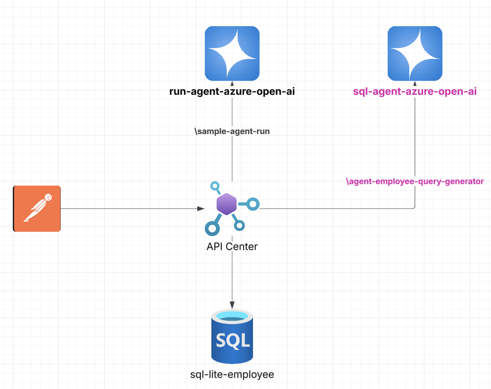
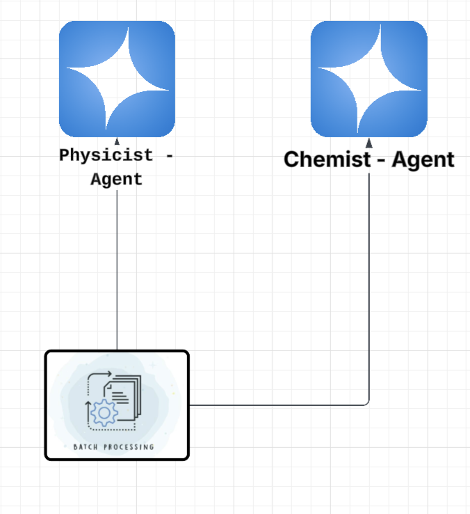

# NetBCConfJan21

This workshop is for .NET programming techniques and skills.
This repository contains the code samples and materials for the NetBC workshop to be held on January 21, 2026.

## 📋 Project One Index
- [Project One](#project-one)
- [Prerequisites](#prerequisites)
- [API Endpoints](#api-endpoints)
- [Setup Instructions](#setup-instructions)
- [Creation of the project](#creation-of-the-project)

## 📋 Project Two Index
- [Project Two](#project-two)
- [Prerequisites](#prerequisites-1)
- [Setup Instructions](#setup-instructions-1)
- [Usage Examples](#usage-examples)
- [Project Structure](#project-structure-1)
- [Creation of the project](#creation-of-the-project-1)

# Project One
-  1. Producing Structured Output With Agents


<details>
<summary>🎯 Overview</summary>

The focus of this workshop session is on producing structured output using agents in .NET applications.
</details>
roducing Structured Output With Agents: 
This tutorial shows you how to produce structured output with an agent, using the Azure OpenAI Chat Completion service.

## API Endpoints

| Endpoint URL | Method | Purpose | Payload (JSON) |
|--------------|--------|---------|----------------|
| `/health-check` | GET | Check if the API is running | None |
| `/agent-run` | POST | Run an agent to provide structured information about a person | `{ "Prompt1": "...", "Prompt2": "...", "NameAssistant": "...", "Description": "...", "schemaName":"...", "schemaDescription":"...", "Intructions":"...", "Go": "..." }` |
| `/sql-agent-run` | POST | Run an SQL assistant to generate PostgreSQL queries | `{ "Prompt1": "...", "NameAssistant": "...", "schemaName":"...", "schemaDescription":"...", "Description": "...", "Intructions":"...", "Go": "..." }` |

### Request Examples

<details>
<summary>🔍 Health Check Example</summary>

```bash
curl -X GET http://localhost:5099/health-check
```
</details>

<details>
<summary>🤖 Agent Run Example</summary>

```bash
curl -X POST http://localhost:5099/agent-run \
-H "Content-Type: application/json" \
-d '{
    "Prompt1": "Cristiano Ronaldo",
    "Prompt2": "Software Engineer",
    "NameAssistant": "HelpfulAssistant",
    "Description" : "An AI assistant that provides structured information about people.",
    "schemaName": "PersonInfo",
    "schemaDescription": "Information about a person including their name, age, and occupation",
    "Intructions" : "You are a helpful assistant that provides structured information about people.",
    "Go" : "Please provide information about {chatConfig.Prompt1} see on the internet, is he {chatConfig.Prompt2} or not?"
}'
```
</details>

<details>
<summary>📊 SQL Agent Example</summary>

```bash
curl -X POST http://localhost:5099/sql-agent-run \
-H "Content-Type: application/json" \
-d '{
    "Prompt1": "Table is employee built as Name VARCHAR(100), Age INT, Occupation VARCHAR(100)",
    "NameAssistant": "SQLHelpfulAssistant",
    "Description" : "An AI assistant that query to inject sql postgres client.",
    "schemaName": "PersonInfo",
    "schemaDescription": "Information about a person including their name, age, and occupation becoming data base",
    "Intructions" : "You are a helpful SQL assistant that provides structured information about people.",
    "Go" : "Please provide a quickly and sample query -  select all employe who is not software enginner remember that - {chatConfig.Prompt1} ?"
}'
```
</details>

## 📝 Response Examples

<details>
<summary>Health Check Response</summary>

```json
{
    "status": "Hello World"
}
```
</details>

<details>
<summary>Agent Run Response</summary>

```json
{
    "name": "Cristiano Ronaldo",
    "age": 39,
    "occupation": "Software Engineer"
}
```
</details>

<details>
<summary>SQL Agent Run Response</summary>

```json
[
    {
        "name": "Jane Smith",
        "age": 28,
        "occupation": "Data Analyst"
    },
    {
        "name": "Alice Johnson",
        "age": 35,
        "occupation": "Product Manager"
    }
]
```
</details>

## Prerequisites
- An Azure OpenAI resource with access to the Chat Completion service.
- .NET 10.0 SDK or later installed on your machine.
## Setup Instructions
1. Clone this repository to your local machine.

# Note: if you do not have SQLite to run the project
Type ``sqlite3 --version`` in a terminal window to find out whether or not you have SQLite on your computer.
- If you do not have SQLite you can run ``setup_sqlite.sh`` found in _../../sql-lite_ folder:
- First run ``chmod +x setup_sqlite.sh`` in a terminal window
- Next, run `./setup_sqlite.sh` in a terminal window

2. Navigate to the project directory.
3. Open the _appsettings.json_ file and configure your Azure OpenAI settings:
```json
 "AzureOpenAI": {
    "Endpoint": "",
    "ApiKey": "",
    "DeploymentName": "gpt-4.1-mini"
  },
  ```
  Run 
4. Restore the project dependencies by running:
   ```bash
   dotnet restore
   ```
5. Build the project using:
```bash
dotnet build
```
6. Run the application with:
```bash
dotnet run
```
7. The API will be accessible at `http://localhost:5099`.

## Review of the input models
The input models for the `/agent-run` and `/sql-agent-run` endpoints are defined as follows:
```csharp
public class AgentRequest
{
    public string Prompt1 { get; set; }
    public string Prompt2 { get; set; }
    public string NameAssistant { get; set; }
    public string Description { get; set; }
    public string schemaName { get; set; }
    public string schemaDescription { get; set; }
    public string Intructions { get; set; }
    public string Go { get; set; }
}
public class SqlAgentRequest
{
    public string Prompt1 { get; set; }
    public string NameAssistant { get; set; }
    public string Description { get; set; }
    public string schemaName { get; set; }
    public string schemaDescription { get; set; }
    public string Intructions { get; set; }
    public string Go { get; set; }
}
```
These models capture the necessary information to configure and run the agents for structured output generation.

## Describing each field
- `Prompt1`: The primary input prompt for the agent.
- `Prompt2`: An additional input prompt for the agent (used only in `/agent-run`).
- `NameAssistant`: The name of the assistant to be used.
- `Description`: A brief description of the assistant's purpose.
- `schemaName`: The name of the schema for the structured output.
- `schemaDescription`: A description of the schema for the structured output.
- `Intructions`: Instructions for the agent on how to process the input prompts.
- `Go`: The main instruction or query for the agent to execute.

## Note for Prompt fields
We can use the Prompt1 and Prompt2 fields as dynamic variables.
## Note for _schemaName_ fields
schemaName are the models which we want the agent to know about when processing data.

## Creation of the project
To create a similar project from scratch, follow these steps:
1. Create a new .NET Web API project:
    ```bash
    dotnet new webapi -n AzureOpenAIAgentAPI
    cd AzureOpenAIAgentAPI
    ```
2. Add necessary NuGet packages for Azure OpenAI and any other dependencies.
There are the packages that need to be added to your .csproj project file.
```xml
<Project Sdk="Microsoft.NET.Sdk.Web">

  <PropertyGroup>
    <TargetFramework>net10.0</TargetFramework>
    <Nullable>enable</Nullable>
    <ImplicitUsings>enable</ImplicitUsings>
  </PropertyGroup>

  <ItemGroup>
    <PackageReference Include="Azure.AI.OpenAI" Version="2.7.0-beta.2" />
    <PackageReference Include="Azure.Identity" Version="1.17.1" />
    <PackageReference Include="Dapper" Version="2.1.66" />
    <PackageReference Include="Microsoft.Agents.AI.OpenAI" Version="1.0.0-preview.251204.1" />
    <PackageReference Include="Microsoft.Data.Sqlite" Version="10.0.1" />
    <PackageReference Include="Npgsql" Version="10.0.0" />
  </ItemGroup>

</Project>
```
3. Implement the API endpoints as shown in the tutorial.

## Project Structure

### Models/ Folder
Contains data models used by the API to structure requests and responses:

**AIResponse.cs**
```csharp
public class AIResponse
{
    public string? AIAnswer { get; set; }
}
```
- Model used to capture AI agent responses
- `AIAnswer` property stores the structured response generated by the agent

**ChatConfig.cs**
```csharp
public class ChatConfig
{
    public string? Prompt1 { get; set; }
    public string? Prompt2 { get; set; }
    public string? NameAssistant { get; set; }
    public string? Description { get; set; }
    public string? SchemaName { get; set; }
    public string? SchemaDescription { get; set; }
    public string? Intructions { get; set; }
    public string? Go { get; set; }
}
```
- Main model for AI agent configuration
- Contains all necessary parameters to customize assistant behavior
- Used in `/agent-run` and `/employees` endpoints

**PersonInfo.cs**
```csharp
public class PersonInfo
{
    public string? Name { get; set; }
    public int? Age { get; set; }
    public string? Occupation { get; set; }
    public string? AIresponse { get; set; }
}
```
- Structured response model for person information
- Defines the expected schema for AI agent output
- `AIresponse` property can contain additional agent information

### Entities/ Folder
Contains entities that represent database data:

**PersonEntity.cs**
```csharp
public class PersonEntity
{
    public string? Name { get; set; }
    public int? Age { get; set; }
    public string? Occupation { get; set; }
}
```
- Entity that maps the `employee` database table
- Used by Dapper for object-relational mapping
- Simple structure with basic employee information

### Dapper/ Folder (Repository)
Contains data access layer using Dapper:

**EmployeeRepository.cs**
```csharp
public class EmployeeRepository
{
    private readonly string _connectionString;

    public EmployeeRepository(string connectionString)
    {
        _connectionString = connectionString;
    }

    public async Task<IEnumerable<PersonEntity>> GetEmployeesAsync(string filter)
    {
        try
        {
            using (IDbConnection dbConnection = new NpgsqlConnection(_connectionString))
            {
                dbConnection.Open();
                var employees = await dbConnection.QueryAsync<PersonEntity>(filter);
                return employees;
            } 
        }
        catch (Exception ex)
        {
            using (IDbConnection dbConnection = new SqliteConnection(_connectionString))
            {
                dbConnection.Open();
                var employees = await dbConnection.QueryAsync<PersonEntity>(filter);
                return employees;
            }
        }
    }
}
```
- Repository responsible for employee data access
- Implements automatic fallback: tries PostgreSQL first, then SQLite
- Uses Dapper for executing dynamic queries generated by AI
- `GetEmployeesAsync` method accepts SQL queries as strings (generated by agent)

### sql-lite/ Folder
Contains configuration and scripts for local SQLite database:

**setup_sqlite.sh**
- Bash script for automatic SQLite installation
- Detects operating system (Linux/macOS)
- Creates folder structure and database
- Executes initialization script automatically

**database/init.sql**
```sql
CREATE TABLE IF NOT EXISTS employee (
    Name TEXT,
    Age INTEGER,
    Occupation TEXT
);

INSERT INTO employee (Name, Age, Occupation) VALUES
('John Doe', 30, 'Software Engineer'),
('Jane Smith', 28, 'Data Analyst'),
('Alice Johnson', 35, 'Product Manager');
```
- SQLite database initialization script
- Creates `employee` table with basic structure
- Inserts sample data for testing
- Structure compatible with PostgreSQL for easy migration

**database/app.db**
- SQLite database file generated automatically
- Contains employee data for local development
- Used as fallback when PostgreSQL is not available

## _Program.cs_ - step-by-step breakdown

Let's walk through the main _Program.cs_ file:

### Step 1: Import Required Libraries
```csharp
using Azure;
using Azure.AI.OpenAI;
using Microsoft.Agents.AI;
using Microsoft.Extensions.AI;
using System.Text.Json;
using OpenAI;
```
**What this does:** Imports all necessary libraries for Azure OpenAI, AI agents, JSON handling, and dependency injection.

### Step 2: Create Web Application Builder
```csharp
var builder = WebApplication.CreateBuilder(args);
```
**What this does:** Creates the foundation for our web API application with default configurations.

### Step 3: Configure Database Connection
```csharp
builder.Services.AddSingleton(sp =>
    builder.Configuration.GetConnectionString("DefaultConnection") ?? string.Empty
);
```
**What this does:** Registers the database connection string as a singleton service that can be injected anywhere in the app.

### Step 4: Register Repository Service
```csharp
builder.Services.AddScoped<EmployeeRepository>();
```
**What this does:** Registers our EmployeeRepository for dependency injection with scoped lifetime (one instance per request).

### Step 5: Read Azure OpenAI Configuration
```csharp
string endpoint = builder.Configuration["AzureOpenAI:Endpoint"] ?? throw new InvalidOperationException("AzureOpenAI:Endpoint configuration is missing");
string apiKey = builder.Configuration["AzureOpenAI:ApiKey"] ?? throw new InvalidOperationException("AzureOpenAI:ApiKey configuration is missing");
string deploymentName = builder.Configuration["AzureOpenAI:DeploymentName"] ?? throw new InvalidOperationException("AzureOpenAI:DeploymentName configuration is missing");
```
**What this does:** Reads Azure OpenAI settings from _appsettings.json_ and throws errors if any are missing.

### Step 6: Build the Application
```csharp
var app = builder.Build();
```
**What this does:** Creates the actual web application instance with all configured services.

### Step 7: Create Simple Health Check Endpoint
```csharp
app.MapGet("/", () => "Hello World!");
```
**What this does:** Creates a basic GET endpoint at root URL that returns "Hello World!" for testing.

### Step 8: Create _Employee_ Query Endpoint
```csharp
app.MapPatch("/employees", async (EmployeeRepository repository, HttpContext context) =>
{
    // Read request body as ChatConfig
    var chatConfig = await context.Request.ReadFromJsonAsync<ChatConfig>();
    
    // Create JSON schema for AI response
    JsonElement schema = AIJsonUtilities.CreateJsonSchema(typeof(AIResponse));
    
    // Configure chat options with schema
    ChatOptions chatOptions = new()
    {
        Instructions = chatConfig!.Intructions,
        ResponseFormat = ChatResponseFormat.ForJsonSchema(
            schema: schema,
            schemaName: chatConfig.SchemaName,
            schemaDescription: chatConfig.SchemaDescription)
    };
    
    // Create AI agent
    AIAgent agent = new AzureOpenAIClient(
            new Uri(endpoint),
            new AzureKeyCredential(apiKey))
                .GetChatClient(deploymentName)
                .CreateAIAgent(new ChatClientAgentOptions()
                {
                    Name = chatConfig.NameAssistant,
                    Description = chatConfig.Description,
                    ChatOptions = chatOptions
                });
    
    // Replace dynamic variables in message
    string? dynamicMessage = chatConfig!.Go!.Replace("{chatConfig.Prompt1}", chatConfig.Prompt1)
                                            .Replace("{chatConfig.Prompt2}", chatConfig.Prompt2);
    
    // Run AI agent and get SQL query
    var response = await agent.RunAsync(dynamicMessage);
    var filter = response.Deserialize<AIResponse>(JsonSerializerOptions.Web);
    
    // Execute SQL query and return results
    var employees = await repository.GetEmployeesAsync(filter.AIAnswer!);
    
    return Results.Ok(employees);
});
```
**What this does:** 
- **Step 8a:** Reads _ChatConfig_ from request body
- **Step 8b:** Creates JSON schema for structured AI responses
- **Step 8c:** Configures AI agent with instructions and response format
- **Step 8d:** Creates Azure OpenAI agent instance
- **Step 8e:** Replaces placeholder variables in the prompt
- **Step 8f:** Runs AI agent to generate SQL query
- **Step 8g:** Executes the generated SQL query and returns employee data

### Step 9: Create _Person_ Information Endpoint
```csharp
app.MapPost("/agent-run", async (HttpContext context) => {
    // Read request body as ChatConfig
    var chatConfig = await context.Request.ReadFromJsonAsync<ChatConfig>();

    // Create JSON schema for PersonInfo
    JsonElement schema = AIJsonUtilities.CreateJsonSchema(typeof(PersonInfo));

    // Configure chat options
    ChatOptions chatOptions = new()
    {
        Instructions = chatConfig!.Intructions,
        ResponseFormat = ChatResponseFormat.ForJsonSchema(
            schema: schema,
            schemaName: chatConfig.SchemaName,
            schemaDescription: chatConfig.SchemaDescription)
    };

    // Create AI agent
    AIAgent agent = new AzureOpenAIClient(
            new Uri(endpoint),
            new AzureKeyCredential(apiKey))
                .GetChatClient(deploymentName)
                .CreateAIAgent(new ChatClientAgentOptions()
                {
                    Name = chatConfig.NameAssistant,
                    Description = chatConfig.Description,
                    ChatOptions = chatOptions
                });
    
    // Replace dynamic variables
    string? dynamicMessage = chatConfig!.Go!.Replace("{chatConfig.Prompt1}", chatConfig.Prompt1)
                                            .Replace("{chatConfig.Prompt2}", chatConfig.Prompt2);
    
    // Run AI agent and return person info
    var response = await agent.RunAsync(dynamicMessage);
    var personInfo = response.Deserialize<PersonInfo>(JsonSerializerOptions.Web);
    return Results.Ok(personInfo);
});
```
**What this does:**
- **Step 9a:** Similar to Step 8, but uses _PersonInfo_ schema instead of _AIResponse_
- **Step 9b:** Generates structured information about a person rather than SQL queries
- **Step 9c:** Returns _PersonInfo object_ with name, age, and occupation

### Step 10: Start the application
```csharp
app.Run();
```
**What this does:** Starts the web server and begins listening for HTTP requests on the configured port.

## Key Programming Concepts Demonstrated:

1. **Dependency Injection:** Services are registered and automatically injected
2. **Configuration Management:** Settings read from _appsettings.json_
3. **Async/Await Pattern:** All database and AI operations are asynchronous
4. **JSON Schema Validation:** AI responses are structured using predefined schemas
5. **Error Handling:** Configuration validation with meaningful error messages
6. **Dynamic String Replacement:** Template variables replaced at runtime
7. **RESTful API Design:** Different HTTP methods for different operations


---

# Project Two
- 2. ConcurrentWorkflow Implementation


<details>
<summary>🎯 Overview</summary>

This project demonstrates concurrent workflow patterns using specialized AI agents (Physicist and Chemist) that process questions simultaneously and aggregate their responses. Built with Microsoft Agents AI Workflows and GitHub Models API.
</details>

# ConcurrentWorkflow Implementation
This tutorial shows you how to implement concurrent workflows using Microsoft Agents AI Workflows with GitHub Models API.

## Prerequisites
- .NET 10.0 SDK or later
- GitHub Personal Access Token with Models access
- Visual Studio or VS Code

## Setup Instructions

<details>
<summary>🚀 Running the Application</summary>

1. Restore dependencies:
   ```bash
   dotnet restore
   ```

2. Build the project:
   ```bash
   dotnet build
   ```

3. Run the application:
   ```bash
   dotnet run
   ```
</details>

## Usage Examples

<details>
<summary>🔍 Sample Questions</summary>

**Question:** "What is temperature?"

**Expected Output:**
```
Physicist: Temperature is a measure of the average kinetic energy of particles in a system...
Chemist: Temperature affects reaction rates and chemical equilibrium according to Le Chatelier's principle...
```
</details>

## Project Structure

```
ConcurrentWorkflow/
├── Program.cs
├── Models/
│   ├── ConcurrentStartExecutor.cs
│   └── ConcurrentAggregationExecutor.cs
└── appsettings.json
```

## Creation of the project

<details>
<summary>🛠️ Step-by-Step Creation</summary>

### 1. Create Console Application
```bash
dotnet new console -n ConcurrentWorkflow
cd ConcurrentWorkflow
```

### 2. Add Required Packages
```bash
dotnet add package Azure.AI.OpenAI --version 2.7.0-beta.2
dotnet add package Microsoft.Agents.AI.Workflows --version 1.0.0-preview.251204.1
```
</details>

## Setup Instructions

<details>
<summary>🚀 Running the Application</summary>

1. Navigate to ConcurrentWorkflow project:
   ```bash
   cd Project-2/ConcurrentWorkflow
   ```

2. Configure `appsettings.json`:
   ```json
   {
       "GitHub": {
           "Token": "your-github-token-here",
           "ApiEndpoint": "https://models.github.ai/inference",
           "Model": "openai/gpt-4o-mini"
       }
   }
   ```

3. Restore dependencies:
   ```bash
   dotnet restore
   ```

4. Build the project:
   ```bash
   dotnet build
   ```

5. Run the application:
   ```bash
   dotnet run
   ```
</details>

## Usage Examples

<details>
<summary>🔍 Sample Questions</summary>

**Question:** "What is temperature?"

**Expected Output:**
```
Physicist: Temperature is a measure of the average kinetic energy of particles in a system...
Chemist: Temperature affects reaction rates and chemical equilibrium according to Le Chatelier's principle...
```

**Other Examples:**
- "What is energy?"
- "Explain atomic structure"
- "How do chemical bonds work?"
- "What is entropy?"
</details>

## Project Structure

```
ConcurrentWorkflow/
├── Program.cs                          # Main application entry point
├── Models/
│   ├── ConcurrentStartExecutor.cs      # Workflow start executor
│   └── ConcurrentAggregationExecutor.cs # Response aggregation executor
├── appsettings.json                    # Configuration file
├── test-token.sh                       # Token validation script
└── ConcurrentWorkflow.csproj          # Project dependencies
```

## Creation of the project

<details>
<summary>🛠️ Step-by-Step Creation</summary>

### 1. Create Console Application
```bash
dotnet new console -n ConcurrentWorkflow
cd ConcurrentWorkflow
```

### 2. Add Required Packages
```bash
dotnet add package Azure.AI.OpenAI --version 2.7.0-beta.2
dotnet add package Azure.Identity --version 1.17.1
dotnet add package Microsoft.Agents.AI.Workflows --version 1.0.0-preview.251204.1
dotnet add package Microsoft.Extensions.AI.OpenAI --version 10.1.0-preview.1.25608.1
dotnet add package Microsoft.Extensions.Configuration --version 10.0.1
dotnet add package Microsoft.Extensions.Configuration.Json --version 10.0.1
```

### 3. Create Project Structure
```bash
mkdir Models
```

### 4. Key Implementation Files

**Program.cs** - Main workflow orchestration
**Models/ConcurrentStartExecutor.cs** - Workflow initiation
**Models/ConcurrentAggregationExecutor.cs** - Response aggregation
**appsettings.json** - GitHub Models configuration
</details>


